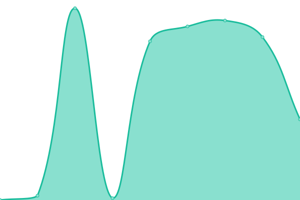

# [📈 Live Status](https://abulgit.github.io/Uptime): <!--live status--> **🟧 Partial outage**

This repository contains the open-source uptime monitor and status page for [Abul Hossain Khan](https://abulgit.github.io/Uptime), powered by [Upptime](https://github.com/upptime/upptime).

With [Upptime](https://upptime.js.org), you can get your own unlimited and free uptime monitor and status page, powered entirely by a GitHub repository. We use [Issues](https://github.com/abulgit/Uptime/issues) as incident reports, [Actions](https://github.com/abulgit/Uptime/actions) as uptime monitors, and [Pages](https://abulgit.github.io/Uptime) for the status page.

<!--start: status pages-->
<!-- This summary is generated by Upptime (https://github.com/upptime/upptime) -->
<!-- Do not edit this manually, your changes will be overwritten -->
<!-- prettier-ignore -->
| URL | Status | History | Response Time | Uptime |
| --- | ------ | ------- | ------------- | ------ |
|  [Glitch](https://bknd-api.glitch.me/ping) | 🟥 Down | [glitch.yml](https://github.com/abulgit/Uptime/commits/HEAD/history/glitch.yml) | 

 9405ms
     
 | 

<a href="https://abulgit.github.io/Uptime/history/glitch">99.84%</a>
    

|  [GitHub](https://github.com/) | 🟩 Up | [git-hub.yml](https://github.com/abulgit/Uptime/commits/HEAD/history/git-hub.yml) | 

 130ms
     
 | 

<a href="https://abulgit.github.io/Uptime/history/git-hub">100.00%</a>
    

<!--end: status pages-->

[**Visit our status website →**](https://abulgit.github.io/Uptime)
